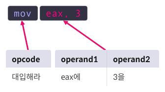

x64 Assembly Language
=====================
Basic Structure
---------------
- Opcode : 명령어
- Operand : 피명령어


***

Operation Code(Opcode)
-----------
|명령 코드||
|:-------|-:|
|데이터 이동(Data Transfer)|mov, lea|
|산술 연산(Arithmetic)|inc, dec, add, sub|
|논리 연산(Logical)|and, or, xor, not|
|비교(Comparison)|cmp, test|
|분기(Branch)|jmp, je, jg|
|스택(Stack)|push, pop|
|프로시져(Procedure)|call, ret, leave|
|시스템 콜(System call)|syscall|
***

Operands
-----------
- 3-type
    1) Immediate Value
    2) Register
    3) Memory
- Format
    > (Size Directive) TYPE PTR + [Address]
    - Size Directive : BYTE(1-byte), WORD(2-bytes), DWORD(4-bytes), QWORD(8-bytes)
- ex)
    - QWORD PTR [0x8048000] : 0x8048000의 데이터를 8바이트만큼 참조
    - DWORD PTR [0x8048000] : 0x8048000의 데이터를 4바이트만큼 참조
    - WORD PTR [rax] : rax가 가르키는 주소에서 데이터를 2바이트 만큼 참조
***
x86-64 Assembly Instruction
===========================
Data Transfer
-------------
- Move designated memory or register's value to operands
- ex) mov dst, src : move src's value to dst
    - mov rdi, rsi : move rsi value to rdi
    - mov QWORD PTR[rdi], rsi : move rsi value to address that QWORD PTR[rdi] appoint
    - mov QWORD PTR[rdi+8*rcx], rsi : move rsi value to QWORD PTR[rdi+8*rcx] appoint
- ex) lea dst, src : save src's effective address to dst
    - lea rsi, [rbx+8*rcx] : save rsi address of rbx+8*rcx
- What is difference?
    - mov transmit ***Value***
    - lea transmit ***Address***
```x86asm
[Register]
rbx = 0x401A40
-----------------------------
[Memory]
0x401a40 | 0x0000000012345678
0x401a48 | 0x0000000000C0FFEE
0x401a50 | 0x00000000DEADBEEF
0x401a58 | 0x00000000CAFEBABE
0x401a60 | 0x0000000087654321
-----------------------------
1: mov rax, [rbx+8]
2: lea rax, [rbx+8]
-----------------------------
result:
    code 1 : rax = 0xC0FFEE
    code 2 : rax = 0x401A48
```
***
Arithmetic Operation
---------------------
- Add, Subtract, Product, Divide
- ex) add dst, src : dst에 src의 값을 더합니다.
    - add eax, 3 : eax += 3
    - add ax, WORD PTR[rdi] : ax += *(WORD *)rdi
        - ax에 rdi의 2byte 데이터 만큼을 더한다
- ex) sub dst, src : dst에서 src의 값을 뺍니다.
    - sub eax, 3 : eax -= 3
    - sub ax, WORD PTR[rdi] : ax -= *(WORD *)rdi
- ex) inc op: op의 값을 1 증가시킴
    - inc eax : eax += 1
- ex) dec op: op의 값을 1 감소 시킴
    - dec eax : eax -= 1
```x86asm
[Register]
rax = 0x31337
rbx = 0x555555554000
rcx = 0x2  

==================================  

[Memory]
0x555555554000| 0x0000000000000000
0x555555554008| 0x0000000000000001
0x555555554010| 0x0000000000000003
0x555555554018| 0x0000000000000005
0x555555554020| 0x000000000003133A  

==================================  

[Code]
1: add rax, [rbx+rcx*8]
2: add rcx, 2
3: sub rax, [rbx+rcx*8]
4: inc rax  

==================================  

result:
    code 1 : increase rax about value of rbx+0x10(0x555555554010) -> 3
    code 2 : add 2 to rcx value(0x2)
    code 3 : subtract rax about value of rbx+0x20 -> 0x3133A
    code 4 : rax + 1
```
***
Logical Operation
-----------------
- ex) and dst, src
```x86asm
[Register]
eax = 0xffff0000
ebx = 0xcafebabe

[Code]
and eax, ebx

[Result]
eax = 0xcafe0000
```
- ex) or dst, src
```x86asm
[Register]
eax = 0xffff0000
ebx = 0xcafebabe

[Code]
or eax, ebx

[Result]
eax = 0xffffbabe
```
- ex) xor dst, src
```x86asm
[Register]
eax = 0xffffffff
ebx = 0xcafebabe

[Code]
xor eax, ebx

[Result]
eax = 0x35014541
```
- ex) not op - bit reversing
```x86asm
[Register]
eax = 0xffffffff
ebx = 0xcafebabe

[Code]
xor eax, ebx

[Result]
eax = 0x35014541
```
***
Comparison Operation
-----------------
- Basically, not a saving operation : just flagging operation
- cmp op1, op2 : compare op1 and op2 by subtract
```x86asm
[Code]
1: mov rax, 0xA
2: mov rbx, 0xA
3: cmp rax, rbx ; ZF=1
```
- test op1, op2 : compare op1 and op2 by and-operation
```x86asm
[Code]
1: xor rax, rax
2: test rax, rax ; ZF=1
```
***
Branch Operation
-----------------
- jmp addr: transfer code flow to addr
```x86asm
[Code]
1: xor rax, rax
2: jmp 1 ; jump to 1
```
- je addr: jump to addr if before comparison is equal
```x86asm
[Code]
1: mov rax, 0xcafebabe
2: mov rbx, 0xcafebabe
3: cmp rax, rbx ; rax == rbx
4: je 1 ; jump to 1
```
- jg addr: jump to if before comparison is greater
```x86asm
[Code]
1: mov rax, 0x31337
2: mov rbx, 0x13337
3: cmp rax, rbx ; rax > rbx
4: jg 1  ; jump to 1
```
***
Summary
=======
### 1. 데이터 이동 연산자
    - mov dst, src: src의 값을 dst에 대입
    - lea dst, src: src의 유효 주소를 dst에 대입

### 2. 산술 연산
    - add dst, src: src의 값을 dst에 더함
    - sub dst, src: src의 값을 dst에서 뺌
    - inc op: op의 값을 1 더함
    - dec op: op의 값을 1 뺌

### 3. 논리 연산
    - and dst, src: dst와 src가 모두 1이면 1, 아니면 0
    - or dst, src: dst와 src중 한 쪽이라도 1이면 1, 아니면 0
    - xor dst, src: dst와 src가 다르면 1, 같으면 0
    - not op: op의 비트를 모두 반전

### 4. 비교
    - cmp op1, op2: op1에서 op2를 빼고 플래그를 설정
    - test op1, op2: op1과 op2에 AND 연산을 하고, 플래그를 설정

### 5. 분기
    - jmp addr: addr로 rip 이동
    - je addr: 직전 비교에서 두 피연산자의 값이 같을 경우 addr로 rip 이동
    - jg addr: 직전 비교에서 두 피연산자 중 전자의 값이 더 클 경우 addr로 rip 이동