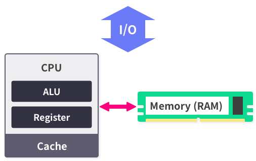
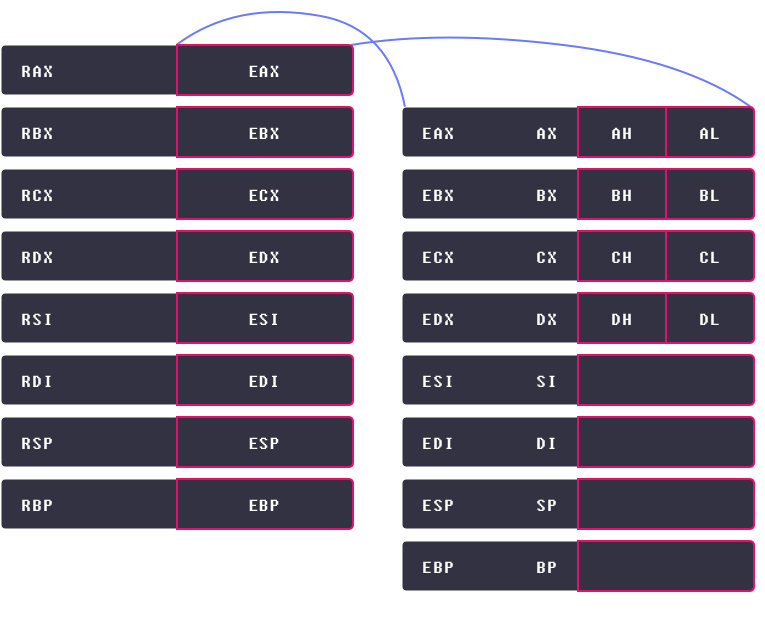

Von Neumann Architecture(Operation, Control, Save)
============================
- CPU(Operation & Control) : Execture operation & Control System
    - Perform arithmetic & logical operation(ALU)
    - CPU controll(Control Unit)
    - Save Data(Register)
- Memory Device(Disk/RAM)
    - Main memory(RAM)
        - Save temporary data used for exectue program
    - Sub memory(HDD, SSD)
        - Save long-time data(ex OS, porgram)
- Bus
    - Signal transporter
    - Data Bus : data
    - Address Bus : assign address
    - Control Bus : control read/write
    - etc : LAN cable, protocol...
- Von Neumann Architecture Layout

***

기억장치가 있는데 CPU안에 레지스터가 왜 필요한가요?
-------------------------------

CPU는 굉장히 빠른 속도로 연산을 처리하는데, 이를 위해 데이터의 빠른 교환이 필요합니다.

예를 들어 사탕을 1초에 100개 생산하는 기계가 있다고 가정합시다. 만약 이 기계에 초당 100개의 재료를 공급하지 못한다면, 재료가 공급될 때까지 대기해야 하므로 최대의 생산효율을 달성할 수 없습니다. 또한 완성된 사탕을 초당 100개씩 가져가지 못한다면, 결국 기계 앞에 사탕이 쌓여서 생산을 중단해야 하는 상황을 맞게 됩니다.

이와 마찬가지로 CPU도 필요한 데이터를 빠르게 공급하고, 반출할 수 있어야 자신의 효율을 제대로 발휘할 수 있습니다. 그런데 CPU의 연산속도가 기억장치와의 데이터 교환속도보다 압도적으로 빠르기 때문에, 기억장치만을 사용하면 병목현상이 발생합니다. 따라서 CPU는 교환속도를 획기적으로 단축하기 위해 레지스터와 캐시라는 저장장치를 내부에 갖고 있습니다.

***
Instruction Set Architecture(ISA)
=================================
- Command set of computer actually understand
- Intel's x86-64 is most popular ISA system
    - High Performance
    - High Power Consumption
    - High Overheat
    - Normally used in Laptop/Desktop
    - Weak in portable embedded system(dron, smartphone, IoT)

***
x86-64 Architecture
=================================
1) N-bit Architecture
    - N means maximum data size that CPU can handle at one command line
    - Noramlly call it ***WORD***
2) WORD size
    - Big word size == Big virtual memory
        - 32-bits VM size -> 4GB
        - 64-bits VM size -> 16,777,216 TB(theoretically)
***

 x86-64의 여러 이름: Intel64, IA-32e, amd64, EM64T …
--------------------------

x86-64는 Intel64, IA-32e, EM64T 또는 amd64라고 불립니다. 이렇게 많은 이명을 갖게 된 이유는 개발 역사가 복잡하기 때문입니다.

1970년도 말부터 인텔은 IA-16과 IA-32 아키텍처로 CPU 시장을 선도했습니다. 인텔은 이 때 당시 개발한 CPU들을 8086, 80186, 80286 등으로 이름 붙였는데, 모두 86으로 끝났기 때문에 x86 CPU라고 불렸습니다.

64비트 아키텍처 개발의 필요성을 느낀 인텔은 2001년 경에 64비트 아키텍처인 IA-64를 발표하고, 이를 이용하는 아이테니움 CPU를 출시했습니다. 그러나 아이테니움은 당시에 존재하던 경쟁사의 CPU들에 비해서 성능상으로 뛰어나지 못했으며, 기존의 x86 아키텍처와 호환되지 않는다는 치명적인 단점이 있었습니다.

기회를 엿본 AMD가 2003년에 x86과 호환되는 64비트 아키텍처를 개발했고, 이를 탑재한 CPU를 출시했습니다. AMD는 이 아키텍처의 이름을 x86-64, 그리고 자사의 이름을 붙인 amd64라고 지었습니다. 당시 x86의 소비층이 두꺼웠고, x86을 대상으로 개발된 소프트웨어가 많았기 때문에 x86-64는 64비트 CPU시장을 빠르게 공략해 나갔습니다.

AMD가 x86을 기반으로 64비트 아키텍처를 개발할 수 있었던 것은 인텔과 AMD가 서로의 기술에 대한 라이센스 공유 협약을 맺었기 때문인데, 자사의 기술을 응용한 x86-64가 시장에서 성공하는 것을 본 인텔은 이를 다시 차용해서 Intel64, IA-32e, EM64T라고 이름붙였습니다. 그래서 실제로 이 둘은 거의 같은 아키텍처입니다. x86은 인텔의 것이고, 이를 64비트로 확장한 기술은 AMD의 것이므로 서로 이득이 되는 교환이었다고 볼 수 있을 것 같습니다.

결과적으로 이런 복잡한 개발과정을 거쳤기 때문에 x86-64는 여러 이름을 갖게 됐습니다. 시스템 해킹을 하다보면 amd64라는 명칭을 자주 볼 수 있는데 x86-64와 같은 아키텍처라고 생각하셔도 됩니다.
***
x86-64 Architecture : Register
=================================
General Register
----------------
- Save 8-bits data
- As the word itself, genral usage
Segment Register

|이름|주용도|
|---|---|
|rax (accumulator register)|함수의 반환 값|
|rbx (base register)|x64에서는 주된 용도 없음|
|rcx (counter register)|반복문의 반복 횟수, 각종 연산의 시행 횟수|
|rdx (data register)|x64에서는 주된 용도 없음|
|rsi (source index)|데이터를 옮길 때 원본을 가리키는 포인터|
|rdi (destination index)|데이터를 옮길 때 목적지를 가리키는 포인터|
|rsp (stack pointer)|사용중인 스택의 위치를 가리키는 포인터|
|rbp (stack base pointer)|스택의 바닥을 가리키는 포인터|

Segment Register
----------------
- 16-bits register
- 6 Segment Registers : cs, ss, ds, es, fs, gs
- cs, ds, ss register used for Code, Data, Stack Segment
- Usage of rest depends on OS type

Instruction Pointer Register(IP)
--------------------------------
- Save program's machine language code's address
- 8-bits register

Flag Register
-------------
- Save current state of process
- 64-bits register(bit-mask)
    - so, total 64 state-flags
    - but, actually use right 20-bits as flag
-  Main flags

|플래그|의미|
|---|---|
|CF(Carry Flag)|부호 없는 수의 연산 결과가 비트의 범위를 넘을 경우 설정 됩니다.|
|ZF(Zero Flag)|연산의 결과가 0일 경우 설정 됩니다.|
|SF(Sign Flag)|연산의 결과가 음수일 경우 설정 됩니다.|
|OF(Overflow Flag)|부호 있는 수의 연산 결과가 비트 범위를 넘을 경우 설정 됩니다.|
    - ex) if a-b is zero-below, then SF signal set as 1 and CPU recognize by SF that result is lower then zero

Register Compatibility
----------------------
앞에서 x86-64 아키텍처는 IA-32의 64비트 확장 아키텍처이며, 호환이 가능하다고 했습니다. IA-32에서 CPU의 레지스터들은 32비트 크기를 가지며, 이들의 명칭은 각각 eax, ebx, ecx, edx, esi, edi, esp, ebp였습니다. 호환성을 위해 이 레지스터들은 x86-64에서도 그대로 사용이 가능합니다.

앞서 소개드린 rax, rbx, rcx, rdx, rsi, rdi, rsp, rbp가 이들의 확장된 형태이며, eax, ebx 등은 확장된 레지스터의 하위 32비트를 가르킵니다. 예를 들어, eax는 rax의 하위 32비트를 의미합니다.

또한 마찬가지로 과거 16비트 아키텍처인 IA-16과의 호환을 위해 ax, bx, cx, dx, si, di, sp, bp는 eax, ebx, ecx, edx, esi, edi, esp ,ebp의 하위 16비트를 가르킵니다.

이들 중 몇몇은 다시 상위 8비트, 하위 8비트로 나뉘는데 이들 전체에 대한 내용은 오른쪽 그림에서 확인할 수 있습니다.

***

Summary
=========
- 범용 레지스터(General Register): 주 용도는 있으나, 그 외의 용도로도 자유롭게 사용할 수 있는 레지스터. x64에는 rax, rbx, rcx, rdx, rsi, rdi, rsp, rbp, r8-r15가 있다.

- 세그먼트 레지스터(Segment Register): 과거에는 메모리 세그멘테이션이나, 가용 메모리 공간의 확장을 위해 사용됐으나, 현재는 주로 메모리 보호를 위해 사용되는 레지스터 x64에는 cs, ss, ds, es, fs, gs가 있다.

- 플래그 레지스터(Flag Register): CPU의 상태를 저장하는 레지스터

- 명령어 포인터 레지스터(Instruction Pointer Register, IP): CPU가 실행해야할 코드를 가리키는 레지스터. x64에서는 rip가 있다.