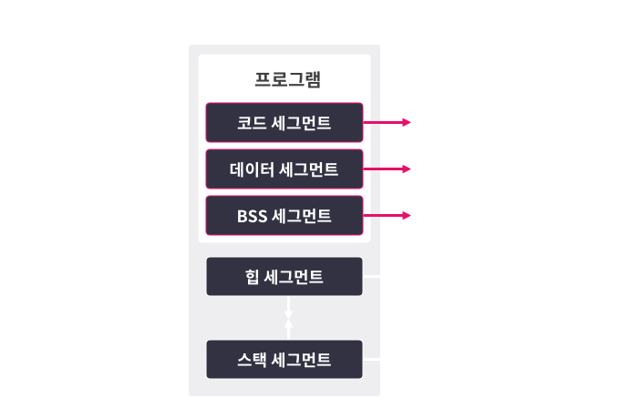

Segment
===
- Linux divide process memory to 5 segment by usage type
- each divided memory has their proper permission about read, write, execution
    - CPU can only process actions that are permitted to memory.
- more information : segmentation method & x86-64(x64) hardware design
- 

Code Segment(Text Segment)
------------
- Area that actual executable machine code place
- Assign read/write authorization
    - If write authorization assigned, hacker more easy to insert malicious code, so in modern OS unassigned write authorization
- from below code, when main function compile, code transform to machine language 554889e5b8697a00005dc3. This code save inside code segment
```
int main() { return 31337; }
```

Data Segment
------------
- static variable or constant that value determined in compile time save inside data segment
- Data segment divided to write authorized segment, and unauthorized segment
    - in authorized segment, save global variable that keep change in runtime
    - in unauthorized segment, save value should not change like global constant
- In below code note to str_ptr
    - str_ptr itself is variable
    - but "readonly" data is constant
    - so str_ptr save in data but string save in rodata

``` C
int data_num = 31337;                       // data
char data_rwstr[] = "writable_data";        // data
const char data_rostr[] = "readonly_data";  // rodata
char *str_ptr = "readonly";  // str_ptr은 data, 문자열은 rodata
int main() { ... }
```

BSS segment
-----------
- Memory that undetermined global variable placed
    - ex) uninitialized variable
- Data in BSS segment initialized to 0 value when program start
- Assign <U>read/write</U>  permission
- In below code, bss_data save inside BSS segment

``` C
int bss_data;
int main() {
  printf("%d\n", bss_data);  // 0
  return 0;
}
```

Stack Segment
-------------
- Placed in stack if process
- Local variable or function parameter save inside this segment
- Stack segment used as unit of **Stack Frame**
- Stack frame create when function called, and return when function end
- Normally, caculate total # of stack frame usage is impossible.
- So, OS start with small amount, and expand when it needed
- Assign <U>read/write</U> permission
- In Below code, choice save in Stack Segment

```C
void func() {
  int choice = 0;
  scanf("%d", &choice);
  if (choice)
    call_true();
  else
    call_false();
  return 0;
}
```

Heap Segment
-------------
- In C language, allocated memory normally place in this segment
    - ex) malloc, calloc
- Assign <U>read/write</U> permission
- In Below code, **heap_data_ptr* is allocated data, so locate in this area
    - but *heap_data_ptr* itself is local variable, so it located in stack segment

```C
int main() {
  int *heap_data_ptr =
      malloc(sizeof(*heap_data_ptr));  // 동적 할당한 힙 영역의 주소를 가리킴
  *heap_data_ptr = 31337;              // 힙 영역에 값을 씀
  printf("%d\n", *heap_data_ptr);  // 힙 영역의 값을 사용함
  return 0;
}
```

******

Concolusion
==========
|Segment Name|Role&nbsp; &nbsp; &nbsp; &nbsp; &nbsp; &nbsp; &nbsp; &nbsp; &nbsp; &nbsp; &nbsp; &nbsp; &nbsp; &nbsp; &nbsp;&nbsp; &nbsp; &nbsp; &nbsp; &nbsp; &nbsp;&nbsp; &nbsp; &nbsp; &nbsp; &nbsp; &nbsp; &nbsp; &nbsp; &nbsp; &nbsp; &nbsp; &nbsp; &nbsp; &nbsp; &nbsp;&nbsp; &nbsp; &nbsp; &nbsp; &nbsp; &nbsp;|Permission|Example|
|---|--------|---|---|
|코드 세그먼트|실행 가능한 코드가 저장된 영역|읽기, 실행|main() 등의 함수 코드|
|데이터 세그먼트|초기화된 전역 변수 또는 상수가 위치하는 영역|읽기와 쓰기 또는 읽기 전용|초기화된 전역 변수, 전역 상수|
|BSS 세그먼트|초기화되지 않은 데이터가 위치하는 영역|읽기, 쓰기|초기화되지 않은 전역 변수|
|스택 세그먼트|임시 변수가 저장되는 영역|읽기, 쓰기|지역 변수, 함수의 인자 등|
|힙 세그먼트|실행중에 동적으로 사용되는 영역|읽기, 쓰기|malloc(), calloc() 등으로 할당 받은 메모리|